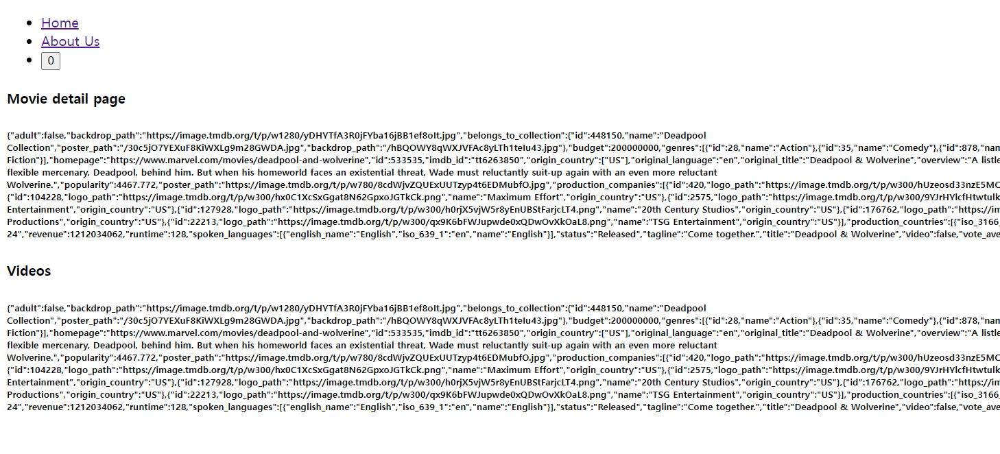

# Suspense

---

### promise all

한 번에 두가지 요청을 받을 때

문제점 : 두 promise가 다 끝날때까지 UI가 보이지 않음 (= 느린 요청을 기달려야 함)

## ⇒ Suspense

로딩 상태를 분리할 수 있도록 하는 것

기존 문제 : page 파일이 직접 fetch한다면 프레임워크는 전체 페이지를 loading component로 바꿈

**사용 효과** :
우리의 component를 await할 수 있게 됨
그 페이지이 파일에서는 await하지 않아도 됨
대신 사용자는 바로 페이지로 이동할 수 있음
데이터가 어디서 로딩될지 선택 가능
데이터를 로딩하는 중에 아무것도 표시하지 않거나 로딩 화면만 표시하는 대신이제 페이지를 로드하고 예쁘게 보이고 많은 정보를 표시한 뒤에 로딩 상태를 분리 할 수 있음

= **로딩은 동시에 준비된 것이 먼저 (기다리지 않고)**

```tsx
import { Suspense } from "react";
import { API_URL } from "../../../(home)/page";
import MoiveInfo from "../../../../components/movie-info";
import MoiveVideos from "../../../../components/movie-videos";

export default async function MovieDetail({
  params: { id },
}: {
  params: { id: string };
}) {
  return (
    <div>
      // 로딩 중인 component의 경계를 만들 수 있음
      <h4>Movie detail page</h4>
      <Suspense fallback={<h1>Loading movie info</h1>}>
        <MoiveInfo id={id} />
      </Suspense>
      // 경계
      <h4>Videos</h4>
      <Suspense fallback={<h1>Loading movie video</h1>}>
        <MoiveVideos id={id} />
      </Suspense>
    </div>
  );
}
```



**fallback ={요소} : 로딩중에 예쁘게 보이게 하기 위함임**

h4로 작성한 코드 = **경계 역할**
