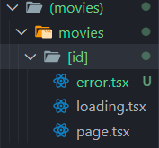
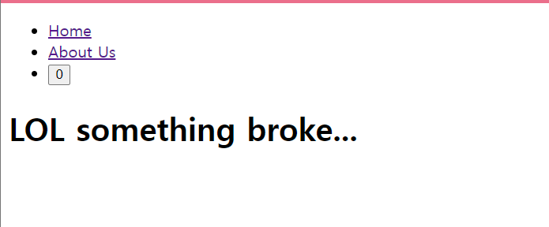

# Error Handling

**바로 옆**에 있는 페이지에서 발생하는 에러에**만** 작동함  
= `/movie/id` 에서만 적용됨


코드
`movie/[id]/error.tsx`

```ts
"use client";

export default function ErrorOMG() {
  return <h1>LOL something broke...</h1>;
}
```

실제 화면

