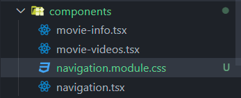
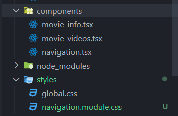

## `global.css`

**layout**에 import한 일반 CSS파일임
(layout에 import하면 **적용**됨)

---

## navigation css 적용

1. `navigation.module.css`

- **module.css**가 중요 (무조건 이렇게 작성해야함)
- **파일 이름** 자체는 별로 **중요하지 않음** (다른 이름이여도 상관없음)
- **어디에 두는 지도 상관 없음**
  
  

**일반적인** tags를 위한 css코드 생성 방식 **X** (ex) **nav**)
**classname만**을 생성함 (ex) **.nav**)

```css
.nav {
  background-color: red;
  padding: 50px 100px;
}
```

여기서 ts파일에 tag들에겐 classname을 주는 것 X

- classname을 사용하면 충돌 가능성이 생김

> 잘못된 방식
> `navigation.tsx`

```ts
"use client";
import Link from "next/link";
import { usePathname } from "next/navigation";
import { useState } from "react";

export default function Navigation() {
  const path = usePathname();
  const [count, setCount] = useState(0);
  return (
    // classname을 줌
    <nav className="nav">
      <ul>// code</ul>
    </nav>
  );
}
```

**js처럼 tsx파일에 import**하기 + **classname={`importName`.`className`}**

> 올바른 방식
> `navigation.tsx`

```ts
"use client";
import Link from "next/link";
import { usePathname } from "next/navigation";
import { useState } from "react";
import styles from "../styles/navigation.module.css"; // import !!!

export default function Navigation() {
  const path = usePathname();
  const [count, setCount] = useState(0);
  return (
    // classname 이렇게 주어야 함
    <nav classname={styles.nav}>
      <ul>// code</ul>
    </nav>
  );
}
```

=> 충돌이 절대 안 생김 !

---

### css에서 주의할 점

**지정한 클래스 명으로 시작해야함**
그렇지 않으면 적용 파일 이외의 다른 곳에서도 적용 됨

```css
.nav {
  background-color: red;
  padding: 50px 100px;
}

// 그냥 ul, li라고 작성하면 안됨 !!!!
// 지정한 클래스 명으로 시작
.nav ul li {
  display: flex;
}
```

#### 이렇게 하기 싫다?

tsx파일에 가서 그 tag에 classname 따로 주기

`navigation.tsx`

```ts
"use client";
// import code
import styles from "../styles/navigation.module.css";

export default function Navigation() {
  // code
  return (
    <nav className={styles.nav}>
      <ul>
        // here !!!!!!!
        <li className={styles.list}>
          <Link href="/">Home</Link> {path === "/" ? "🔥" : ""}
        </li>
        // code
      </ul>
    </nav>
  );
}
```

`navigation.module.css`

```css
.nav {
  background-color: red;
  padding: 50px 100px;
}

.li {
  display: flex;
}
```
