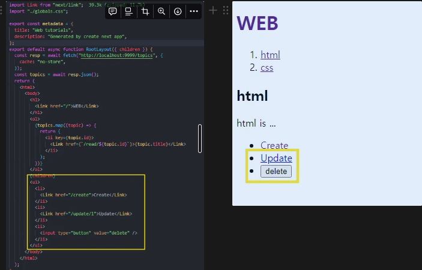
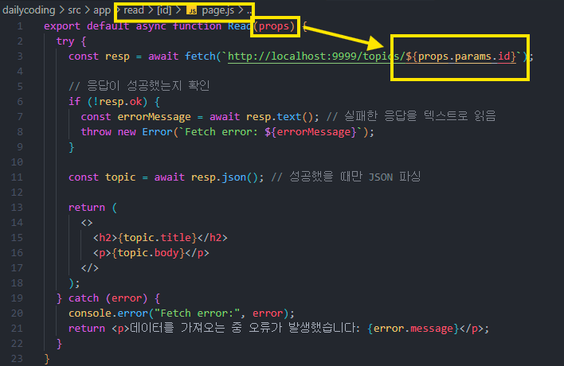
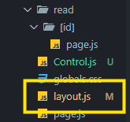
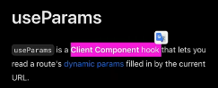
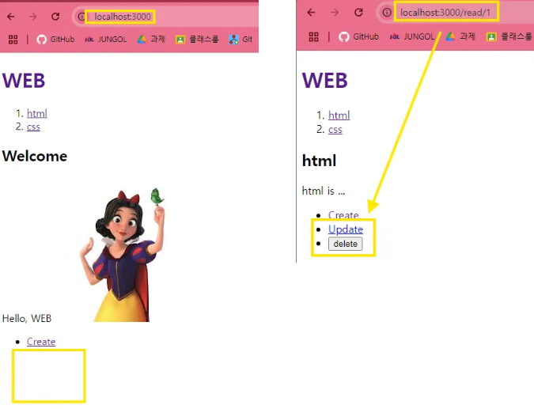
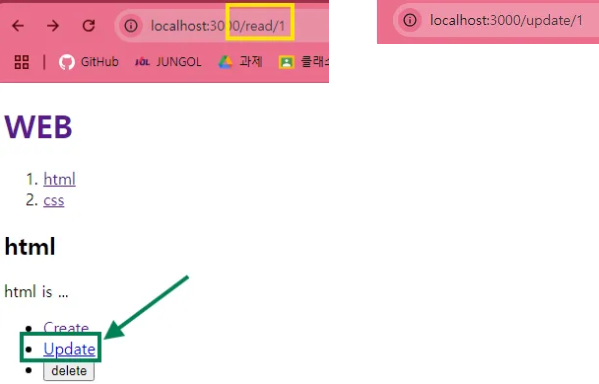

🌈id 존재 여부에 따라 아래를 렌더링 할지 말지를 정하게 하고 싶음
= id값이 필요

그럼 어떻게 가져올까?
이 경우

이런식으로 가져오기 가능

❗하지만 read/[id] 폴더 밖에 있어서 불가능


### ⇒ `useParams` API 사용


client component임 = 우리는 server component라 사용 불가임

> ⭐ 한 폴더 안에서 **특정 부분만 client component로 사용**하고 싶다면 따로 파일을 만들어라.

이렇게 따로 파일을 만들어 사용


---

### 최종 코드

```js
"use client"; // here!!!!
import Link from "next/link";
import { useParams } from "next/navigation";

export default function Control() {
  const params = useParams();
  const id = params.id;
  return (
    <ul>
      <li>
        <Link href="/create">Create</Link>
      </li>
      {/*id값이 있다면 update, delete 보이게 하는 것 = home일 때 X, 글 일 때 O*/}
      {id ? (
        <>
          <li>
            {/*여기 부분도 이렇게 수정 가능해짐 - A */}
            <Link href={"/update/" + id}>Update</Link>
          </li>
          <li>
            <input type="button" value="delete" />
          </li>
        </>
      ) : null}
    </ul>
  );
}
```



**A**
초록 클릭시 `update/id`로 이동

