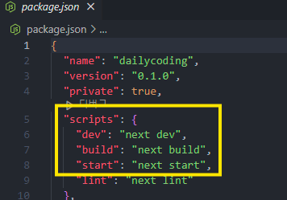
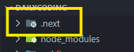
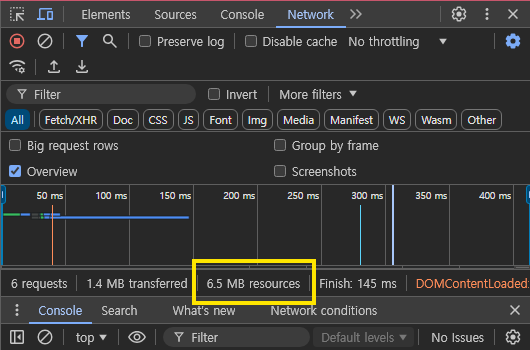
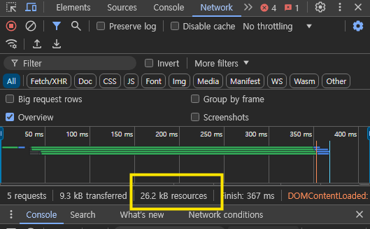

build -> 베포판을 만드는 명령어
start -> 그 베포판을 서비스 하는 명령어

.next 폴더 -> 유저에게 서비스 되는 내용이 저장되는 폴더

---

### npm run build

=> 베포판이 **.next폴더**에 만들어짐
그다음

### npm run start

=> .next에 저장된 내용이 서비스 되기 시작함

---

#### 빌드 전

용량을 너무 많이 차지함

#### 빌드 후

