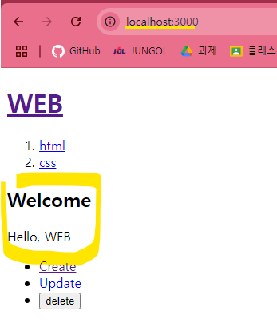

create로 가면


app 폴더 및에서 `create`라는 폴더가 있는지를 확인


그리고 그 폴더(`create`)가 `page.js`를 가지는 지를 확인


그 폴더(`create`)가 `layout.js`를 갖고 있다면?
그것과 결합
하지만 없다?
그 **부모 폴더**로 가서 다시 `layout.js`를 찾음

---

`src/page.js`

```js
export default function Home() {
  return (
    <>
      <h2>Welcome</h2>
      Hello, WEB
    </>
  );
}
```



`src/app/create/page.js`

```js
export default function Create() {
  return <>Create!!</>;
}
```


---

❗하지만 이 경우에는 `create`도 `layout`를 갖고 있는 것이 더 좋다

`props`를 받아주고 페이지를 가져오고 싶다면 해당 위치에 `props.children`을 써준다

```js
export default function Layout(props) {
  return (
    <form>
      <h2>Create</h2>
      {props.children}
    </form>
  );
}
```

---


숫자가 다양하게 변할 때는 어떻게 해야하는 가?
1억개라면 1억개의 페이지를 만들어야하나?
= X
`app`폴더 안에 `read/[id]`이런식으로 대괄호 활용하기 그리고 그 안에 `page.js`넣기

`props`를 주고 `props.params.id`를 통해 값을 얻을 수 있음

```js
export default function Read(props) {
  return (
    <>
      <h2>Read</h2>
      paramters : {props.params.id}
    </>
  );
}
```


