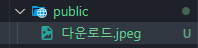
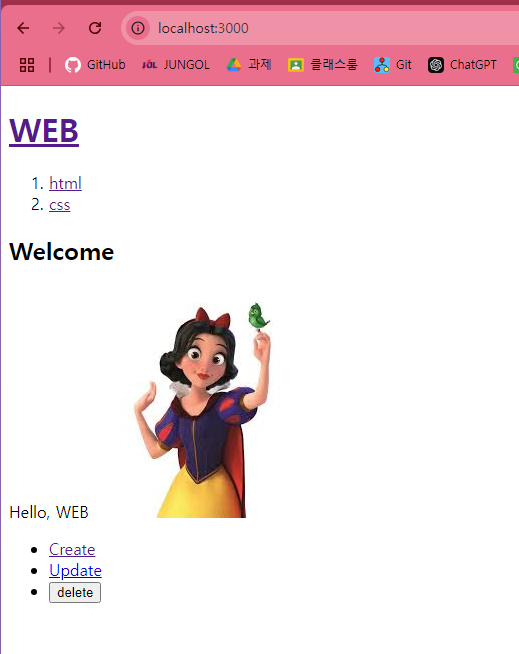
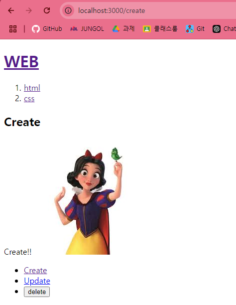

### 정적 자원 사용

1. `public`폴더에 정적으로 사용할 (이미지 등)을 넣는다.
   
2. 사용할 위치에 `img`태그와 `src`를 활용해 불러온다.

- **`/가져올 것`** 은 <u>public 밑</u>의 `가져올 것`을 가르킴

예시)

```js
export default function Home() {
  return (
    <>
      <h2>Welcome</h2>
      Hello, WEB
      </img>
    </>
  );
}
```



```js
export default function Layout(props) {
  return (
    <form>
      <h2>Create</h2>
      {props.children}
      
    </form>
  );
}
```


