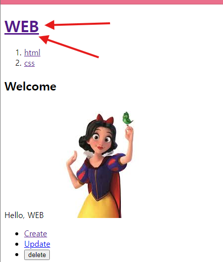
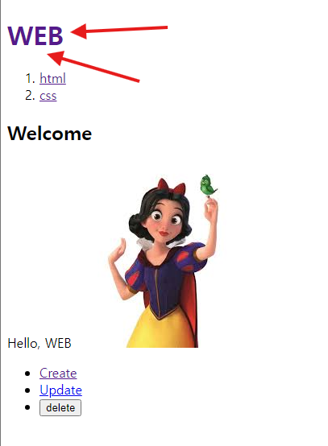

### css

`src/app/layout.js`를 보면 `./globals.css`가 import된 것을 알수 있다.
= 여기서 css 수정 가능

```js
// layout-공통된 부분 관리
import Link from "next/link";
import "./globals.css"; // here !!!!!!!!!!

export const metadata = {
  title: "Web tutorials",
  description: "Generated by create next app",
};

export default function RootLayout({ children }) {
  return (
    <html>
      <body>
        <h1>
          <Link href="/">WEB</Link>
        </h1>
        <ol>
          <li>
            <Link href="/read/1">html</Link>
          </li>
          <li>
            <Link href="/read/2">css</Link>
          </li>
        </ol>
        {children}
        <ul>
          <li>
            <Link href="create">Create</Link>
          </li>
          <li>
            <Link href="update/1">Update</Link>
          </li>
          <li>
            <input type="button" value="delete" />
          </li>
        </ul>
      </body>
    </html>
  );
}
```

---

#### 예시

아무것도 없을 때


변경 후
`globals.css`

```css
h1 a {
  text-decoration: none;
}
```



이런식으로 css를 관리할 수 있다.
