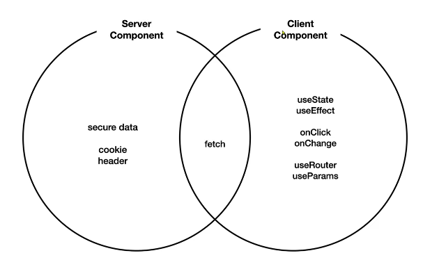
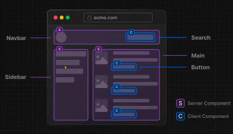
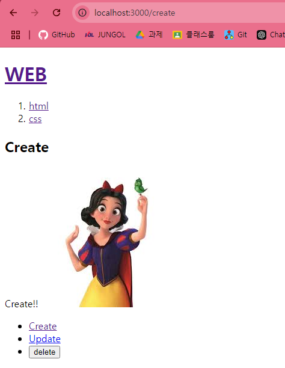

#### json server 도구 이용하기

```
npx json-server --port 9999 --watch db.json
```

- 9999번 포트에서 실행시킴
- --port 9999: 이 서버는 db.json파일에 내용(정보)을 저장
- --watch: 정보가 바뀌면 그것을 바로 서버에 반영하기 위함(db.json파일을 수정되면 바로 서버가 재시동 됨)

---

`db.json`

```
json
{
"posts": [
{ "id": 1, "title": "Hello World" },
{ "id": 2, "title": "JSON Server" }
]
}
```

포트가 9999 주소는 posts

파일에 있는 내용을 json 데이터 형태로 응답함

내가 원하는 거 추가해보기 => db.json수정하기

`db.json`

```
{
  "topics": [
    { "id": 1, "title": "html", "body": "html is ..." },
    { "id": 2, "title": "css", "body": "css is ..." }
    ],
  "posts": [
    { "id": 1, "title": "Hello World" },
    { "id": 2, "title": "JSON Server" }
  ]
}
```


json 데이터 형태로 응답

---

### 서버와의 통신

**명령어**

```
fetch().then().then()
```

**사용**

```
fetch('http://localhost:9999/topics')
  .then((resp)=>{
    return resp.json(); // 서버가 준 데이터는 json이야 그나까 그 json을 js처럼 컴포팅해
  })
  .then(result=>{
    console.log('result',result);
});
```

1. 서버와 통신이 일어남
2. 통신 결과가 출력
   
