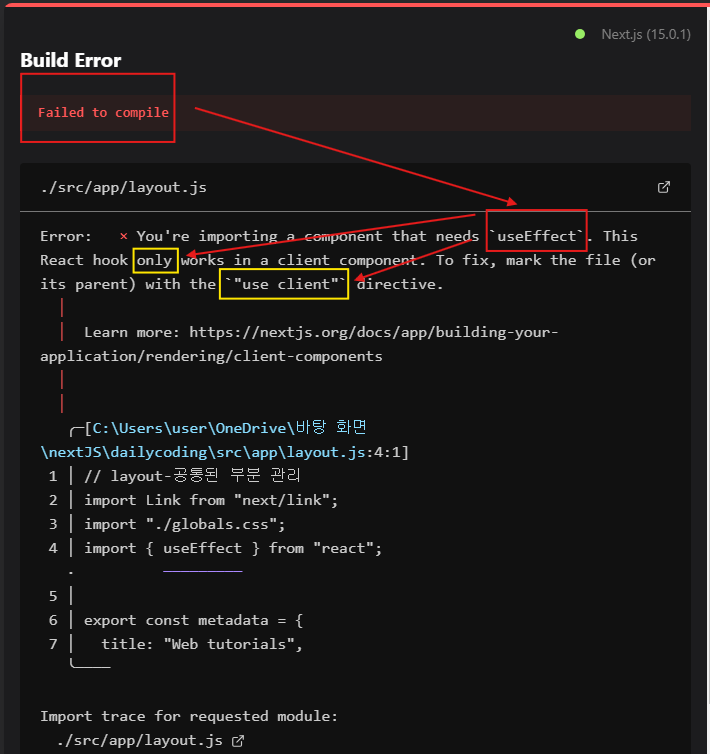
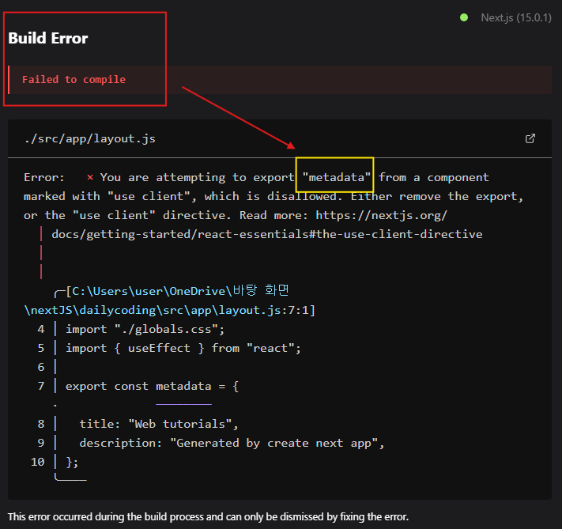

## Server component VS Client compoent


- 리액트가 18버전부터 이렇게 서버 컴퍼넌트라는 개념이 추가가 됨 ← 이걸 next.js가 가져옴
- **Next.js는 기본적으로 컴포넌트를 서버 컴포넌트라고 간주함⭐⭐**


s = 정보를 표현하는데 사용자와는 **상호작용 X** ⇒ **서버 컴포넌트**로 만드는 것이 유리함
c = 상호작용 O ⇒ 해당 부분**만** **새**로운 컴포넌트로 만들어서 **클라이언트 컴포넌트**로 만드는 것이 더 유리함

### 정리

- user 상호작용 O ⇒ client
- user 상호작용 X ⇒ server

---


❗error 발생

기본적으로 서버 컴포넌트로 간주해서!!

### 클라이언트 코드로 바꾸고 싶다면?

코드 위쪽에 작성하기 ⭐

```
"use client"
```


하지만 에러 발생 ❗

**왜?**
⇒ `metadata`가 **server component**라서

```
export const metadata = {
  title: "Web tutorials",
  description: "Generated by create next app",
};
```

이 부분을 주석 처리하면 error가 사라지는 것을 확인 할 수 있음

그리고 아래 코드를 이용하기

```js
<ol>
  {topics.map((topic) => {
    return (
      <li key={topic.id}>
        <Link href={"/read/${topci.id}"}>{topic.title}</Link>
      </li>
    );
  })}
</ol>
```

---

### 아쉬운 점 !

🚫 If, 서버가 싱가포르에 있고 우리가 서울에 있다면?
useEffect를 이용한 데이터 fetching
= server에서 client로 데이터를 땡겨옴
⇒ 데이터를 가져오는 데 **시간 소모 ↑↑↑**

🚫JS가 꺼진다면?
정적인 내용은 잘 보임
**서버와 통신하는 부분은(useEffect) 실행X**

🚫If, DB에 접속한다면?
DB ID, Password 노출 됨 !!
= 보안적인 문제 발생

---

### How to solve?

1. server component로 바꾸어라

```
"use client"
```

이 부분 삭제

2. fuction을 `async`로 선언

```js
export default async function RootLayout() {
  // code
}
```

3. await

```js
const resp = await fetch("http://localhost:9999/topics");
const topics = await resp.json();
```

> metadata도 이제 사용 가능

⇒ server component는 server쪽에서 fetch method가 호출되고, 얘가 끝날 때까지 await 기다리고, 끝나면 json()으로 바꾸라는 명령이 전달되면서 topic 데이터를 가져와서 그 데이터로 글 목록을 동적으로 생성한 다음에 그렇게 만들어진 결과를 server쪽에(.next폴더) 저장해 놓고 그 최종적인 정적인 내용만 클라이언트로 전송한다.
이때 자바스크립트 코드나 이런것들은 빼고 전송한다.

### 장점

1. 적은 용량
2. 우리가 접근하고 있는 서버가 같은 서버에 있는 주소라면 -> 빠른 이동작이 끝남
3. 서버 쪽에서 렌더링을 끝내고 데이터를 보내기 때문에 JS가 꺼져도 잘 동작한다(서버쪽에서 동적으로 생성한 정적인 내용을 클라이언트로 전달했기 때문)

---

## 글 읽기

```js
export default async function Read(props) {
  try {
    const resp = await fetch(`http://localhost:9999/topics/${props.params.id}`);

    // 응답이 성공했는지 확인
    if (!resp.ok) {
      const errorMessage = await resp.text(); // 실패한 응답을 텍스트로 읽음
      throw new Error(`Fetch error: ${errorMessage}`);
    }

    const topic = await resp.json(); // 성공했을 때만 JSON 파싱

    return (
      <>
        <h2>{topic.title}</h2>
        <p>{topic.body}</p>
      </>
    );
  } catch (error) {
    console.error("Fetch error:", error);
    return <p>데이터를 가져오는 중 오류가 발생했습니다: {error.message}</p>;
  }
}
```
