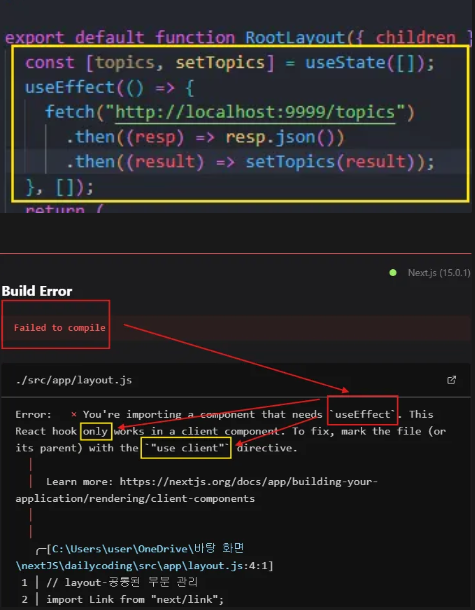

## 서버 컴포넌트 vs 클라이언트 컴포넌트


### 기본 개념


- **서버 컴포넌트**(S):
  - 사용자와 상호작용 없음
  - 서버에서 미리 렌더링
  - 주로 정적 정보 표현
- **클라이언트 컴포넌트**(C):
  - 사용자와 상호작용 있음
  - 동적 상태 관리
  - 해당 부분**만** <u>새로운</u> 컴포넌트로 만들어서 **클라이언트 컴포넌트**로 만드는 것이 더 유리함

### 사용자 상호작용 기준

- **상호작용 O**: 클라이언트 컴포넌트
- **상호작용 X**: 서버 컴포넌트

---

### Next.js 기본 설정

Next.js는 기본적으로 모든 컴포넌트를 서버 컴포넌트라고 간주함⭐⭐

- ex) `useState()`
  
  기본적으로 서버 컴포넌트로 간주해서!!

### 클라이언트 컴포넌트로 변환

- 코드 상단에 추가:

  ```jsx
  "use client";
  ```

- **주의**: 서버 컴포넌트에 정의된 `metadata` 접근 불가

```
export const metadata = {
  title: "Web tutorials",
  description: "Generated by create next app",
};
```


---

### 데이터 Fetching 및 Error Handling

`clinet component`를 사용하면 뭐가 안 좋을까?

### 데이터 Fetching 예시

```jsx
export default async function RootLayout() {
  const resp = await fetch("http://localhost:9999/topics");
  const topics = await resp.json();

  return (
    <ol>
      {topics.map((topic) => (
        <li key={topic.id}>
          <Link href={`/read/${topic.id}`}>{topic.title}</Link>
        </li>
      ))}
    </ol>
  );
}
```

### 아쉬운 점 및 해결 방법

- **문제점**:
  1. 네트워크 지연
  2. JS 비활성화 시 통신 실패
  3. 보안 문제 (DB 접근 시 ID, 비밀번호 노출)
- **해결 방법**:
  1. 클라이언트 컴포넌트로 변환: `"use client"` 삭제 = `serve component`로 바꾸기
  2. 비동기 함수 사용: 컴포넌트를 `async`로 선언
  3. `await` 사용하여 데이터 가져오기

### 데이터 Fetching 개선 예시

```jsx
export default async function Read(props) {
  try {
    const resp = await fetch(`http://localhost:9999/topics/${props.params.id}`);

    if (!resp.ok) {
      const errorMessage = await resp.text();
      throw new Error(`Fetch error: ${errorMessage}`);
    }

    const topic = await resp.json();

    return (
      <>
        <h2>{topic.title}</h2>
        <p>{topic.body}</p>
      </>
    );
  } catch (error) {
    console.error("Fetch error:", error);
    return <p>데이터를 가져오는 중 오류가 발생했습니다: {error.message}</p>;
  }
}
```

⇒ server component는 server쪽에서 fetch method가 호출되고,
얘가 끝날 때까지 await 기다리고,
끝나면 json()으로 바꾸라는 명령이 전달되면서
topic 데이터를 가져와서 그 데이터로 글 목록을 동적으로 생성한 다음에
그렇게 만들어진 결과를 server쪽에(.next폴더) 저장해 놓고 그 최종적인 정적인 내용만 클라이언트로 전송한다.
이때 자바스크립트 코드나 이런것들은 빼고 전송한다.

---

### 장점

1. **적은 용량**: 서버에서 미리 렌더링하여 전송 용량 감소
2. **빠른 반응**: 동일 서버 위치 시 데이터 전송 속도 증가
3. **JS 비활성화에서도 정상 작동**: 서버에서 생성한 정적 내용 전달

---

## 추가 개념 정리

### 1. Hydration (하이드레이션)

- **정의**: 서버에서 생성된 HTML 페이지를 클라이언트에서 활성화하는 과정
- **예시**:
  - 서버가 제공한 웹페이지가 브라우저에 로드되면, React가 버튼 클릭과 같은 상호작용을 추가하여 사용자가 클릭할 수 있는 버튼으로 만듦
- **중요성**:
  - **빠른 로드**: 초기 페이지가 사용자에게 즉시 표시됨
  - **SEO 개선**: 검색 엔진이 콘텐츠를 쉽게 읽을 수 있어 웹사이트의 가시성이 향상

---

### 2. Static Generation (정적 생성) vs. Server-side Rendering (SSR, 서버 측 렌더링)

| **개념**      | **정적 생성 (Static Generation)**                | **서버 측 렌더링 (SSR)**                               |
| ------------- | ------------------------------------------------ | ------------------------------------------------------ |
| **정의**      | 미리 HTML 페이지를 생성하여 제공                 | 사용자가 요청할 때마다 HTML 페이지를 생성              |
| **장점**      | - 페이지 로드 속도가 빠름<br>- 서버 부하 감소    | - 항상 최신 데이터 제공<br>- 사용자 맞춤형 콘텐츠 가능 |
| **적용 사례** | 블로그, 제품 목록 등 **자주 변하지 않는** 콘텐츠 | 사용자 대시보드, 실시간 데이터 페이지 등               |

---

### 3. React Server Components (React 서버 컴포넌트)

- **정의**: 서버에서만 실행되는 React 컴포넌트
- **특징**:
  - 사용자와 직접 상호작용하지 않는 콘텐츠를 다룸
  - 클라이언트의 부담을 줄여 페이지 성능을 향상
- **장점**:
  - **빠른 페이지 로딩**: 서버에서 필요한 데이터만 클라이언트로 전송하여 로딩 속도를 개선
  - **SEO 최적화**: 서버에서 렌더링된 콘텐츠는 검색 엔진이 쉽게 접근 가능

---

## 글 읽기

```js
export default async function Read(props) {
  try {
    const resp = await fetch(`http://localhost:9999/topics/${props.params.id}`);

    // 응답이 성공했는지 확인
    if (!resp.ok) {
      const errorMessage = await resp.text(); // 실패한 응답을 텍스트로 읽음
      throw new Error(`Fetch error: ${errorMessage}`);
    }

    const topic = await resp.json(); // 성공했을 때만 JSON 파싱

    return (
      <>
        <h2>{topic.title}</h2>
        <p>{topic.body}</p>
      </>
    );
  } catch (error) {
    console.error("Fetch error:", error);
    return <p>데이터를 가져오는 중 오류가 발생했습니다: {error.message}</p>;
  }
}
```
