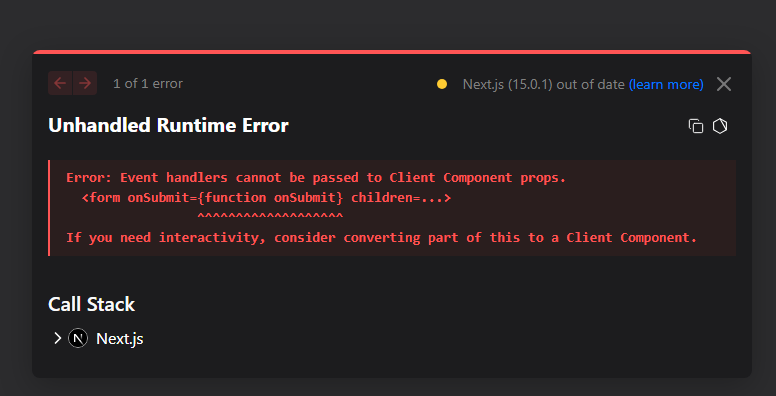

## 글 생성

`src/app/create/page.js`
**onSubmit : 사용자와 상호작용할 때 실행됨 = server component X ⇒ 에러**

```js
export default function Create() {
  return (
    // here !!!!!!
    <form onSubmit={() => {}}>
      <p>
        <input type="text" name="title" placeholder="title" />
      </p>
      <p>
        <textarea name="body" placeholder="body" />
      </p>
      <p>
        <input type="submit" value="create" /> // value : btn에 쓰여지는 text
      </p>
    </form>
  );
}
```



⇒ `"use client"` 사용해서 에러 해결

user가 input에 입력을 하고, create를 하면 기본적으로 웹이 동작하는 방법은 서버쪽으로 데이터를 전송해야하기 때문에 페이지가 **전환**됨
→ 이걸 어떻게 방지? (기본적인 동작 방지)
⇒ `e.preventDefault();` 사용

---

### user가 작성한 값 가져오기

title과 body 가져오기

target : form tag를 가르킴
title : name이 title인 것을 가르킴

```js
const title = e.target.title.value;
const body = e.target.body.value;
```

---

### **`fetch` 요청 옵션 설정 객체**

```jsx
const option = {
  method: "POST",
  headers: {
    "Content-Type": "application/json",
  },
  body: JSON.stringify({ title, body }),
};
```

- **`method`:** 요청 메서드 설정 (예: `"POST"`, `"GET"`, `"PUT"`, `"DELETE"`)
- **`headers`:** 요청에 포함할 HTTP 헤더
  - `"Content-Type": "application/json"`: 요청 본문이 JSON 형식임을 서버에 알림.
- **`body`:** 전송할 데이터
  - **`JSON.stringify({ title, body })`**: 자바스크립트 객체를 JSON 형식으로 변환해 서버로 전송.

---

### **`fetch` 함수**

```jsx
fetch(`http://localhost:9999/topics`, option)
  .then((res) => res.json())
  .then((result) => {
    console.log(result);
  });
```

- **`fetch(url, options)`**: 서버에 네트워크 요청을 보내는 함수
  - **`url`**: 요청을 보낼 서버 주소 (`http://localhost:9999/topics`)
  - **`options`**: 위에서 설정한 요청 옵션 (POST 방식, JSON 데이터 전송)

---

### 리디렉션 - use client

**`router`을 사용한다**

```js
import { useRouter } from "next/navigation"; // navigation임을 주의하기 !!
const router = useRouter();

router.push(`/read/${lastid}`); // 사용
```

---

#### 전체 코드

`src/app/create/page.js`

```js
"use client";

import { useRouter } from "next/navigation";

export default function Create() {
  const router = useRouter();
  return (
    <form
      onSubmit={(e) => {
        e.preventDefault();
        const title = e.target.title.value;
        const body = e.target.body.value;
        const option = {
          method: "POST",
          headers: {
            "Content-Type": "application/json",
          },
          body: JSON.stringify({ title, body }),
        };
        fetch(`http://localhost:9999/topics`, option)
          .then((res) => res.json())
          .then((result) => {
            console.log(result);
            const lastid = result.id;
            router.push(`/read/${lastid}`);
          });
      }}
    >
      <p>
        <input type="text" name="title" placeholder="title" />
      </p>
      <p>
        <textarea name="body" placeholder="body" />
      </p>
      <p>
        <input type="submit" value="create" />
      </p>
    </form>
  );
}
```
