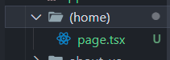

폴더 이름을 **()** 로 묶어야함

-> **URL을 바꾸지 않음** = 괄호 안 이름은 아무거나 상관 없음
`(home)/page.tsx`

```ts
export const metadata = {
  title: "Home",
};

export default function Page() {
  return (
    <div>
      <h1>Hello!</h1>
    </div>
  );
}
```

`about-us/page.tsx`

```ts
export const metadata = {
  title: "About us",
};

export default function AboutUs() {
  return (
    <div>
      <h1>About us!</h1>
    </div>
  );
}
```

`layout.tsx`

```ts
import { Metadata } from "next";
import Navigation from "../components/navigation";

export const metadata: Metadata = {
  title: {
    template: "%s | nest Movie",
    default: "Loading...",
  },
  description: "The best movies on the best framework",
};

export default function Layout({ children }: { children: React.ReactNode }) {
  return (
    <html lang="en">
      <body>
        <Navigation />
        {children}
      </body>
    </html>
  );
}
```
