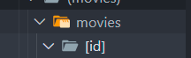
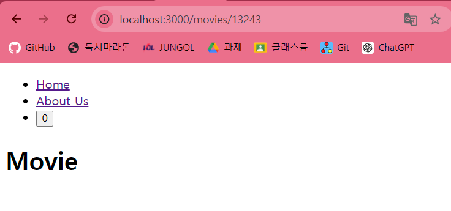
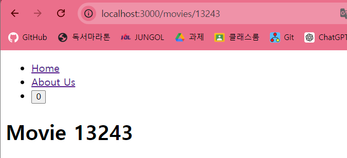

## 동적 세그먼트

폴더 이름을 대괄호([folderName])로 묶어 생성

movie 뒤에 id가 들어가도 괜찮다고 next.js에게 알리는 것


`(movies)/movies/[id]/page.tsx`

```ts
export default function MovieDetail() {
  return <h1>Movie</h1>;
}
```



이때 id는 be에서 받아온 것

---

`(movies)/movies/[id]/page.tsx`

```ts
export default function MovieDetail({
  params: { id },
}: {
  params: { id: string };
}) {
  return <h1>Movie {id}</h1>;
}
```


